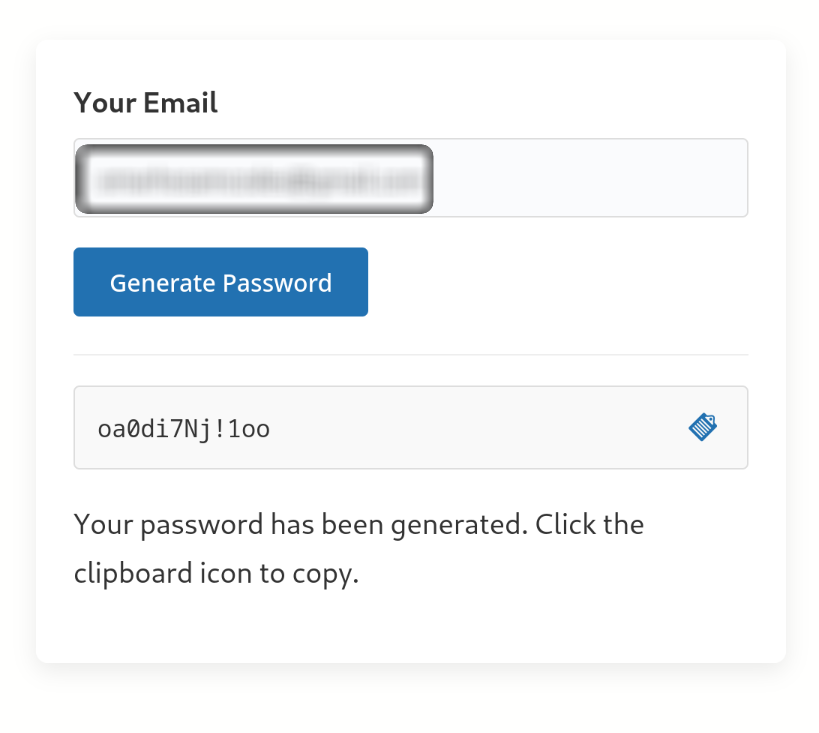

# Easy Password

A WordPress plugin that creates a shortcode for generating and managing user passwords.

## Description

Easy Password is a lightweight WordPress plugin that allows users to generate secure random passwords through a simple form. The plugin creates a shortcode that can be inserted on any page or post, enabling users to:

- Generate strong, secure passwords
- Create new user accounts automatically if they don't exist
- Update passwords for existing users
- Copy generated passwords to clipboard with a single click

## Installation

1. Upload the `easy-password` folder to the `/wp-content/plugins/` directory
2. Activate the plugin through the 'Plugins' menu in WordPress
3. Place the `[easy_password]` shortcode on any page or post where you want the password form to appear

## Usage

1. Add the shortcode `[easy_password]` to any page or post
2. Users can enter their email address in the form
3. When submitted:
   - If the email belongs to an existing user, a new password will be generated and their account will be updated
   - If the email doesn't match any existing user, a new user account will be created with the generated password
4. The generated password will be displayed to the user, who can copy it to their clipboard

## Features

- **User-Friendly Interface**: Clean, intuitive form for generating passwords
- **Secure Password Generation**: Creates strong random passwords with a mix of characters
- **Copy to Clipboard**: One-click copy functionality for convenience
- **Automatic User Creation**: Creates new user accounts if email is not associated with an existing user
- **AJAX-Powered**: No page reload required for submitting the form
- **Mobile-Friendly**: Responsive design works on all devices
- **Customizable**: Style the form to match your website's design

## Requirements

- WordPress 5.0 or higher
- PHP 7.0 or higher

## Support

For support or feature requests, please contact the plugin author.

## Author

Omar Hosam

## Version

1.0

## License

This plugin is licensed under the GPL v2 or later.